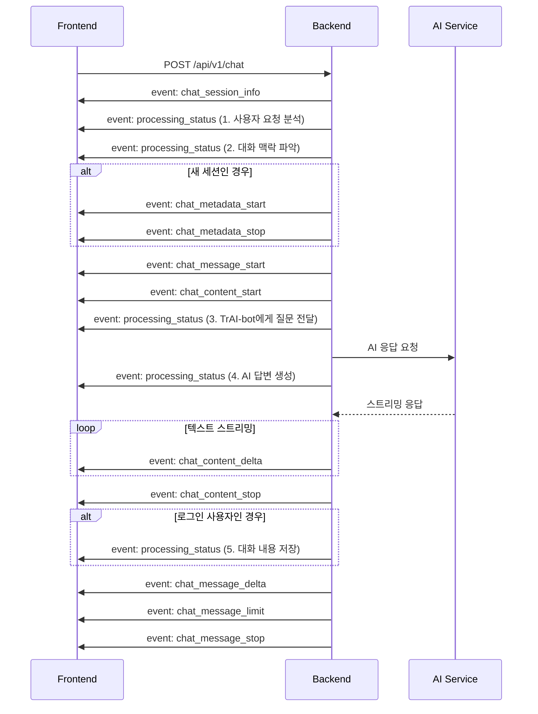
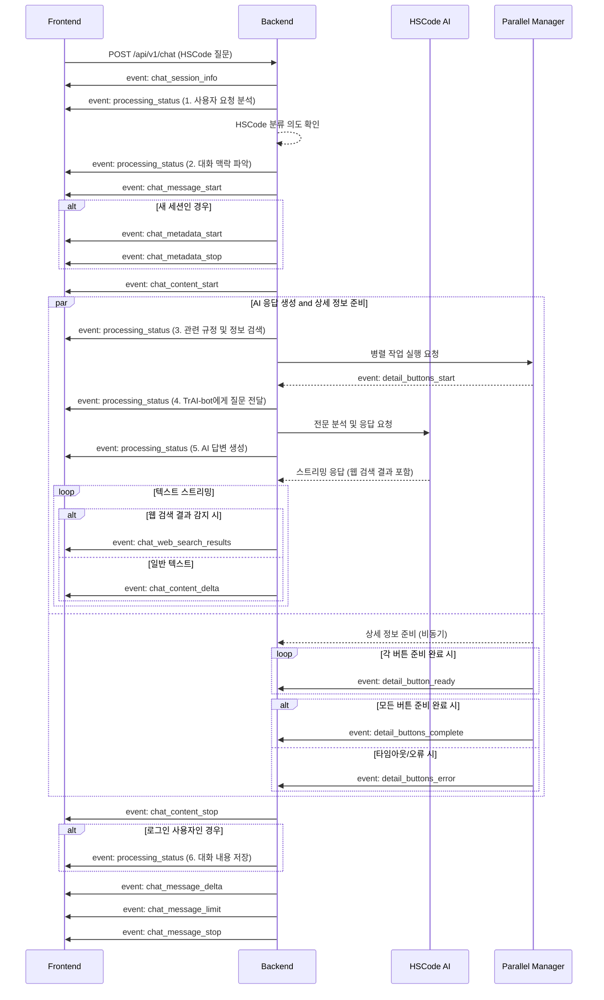

# SSE 이벤트 매핑 가이드 (v3.0)

## 📋 개요

무역 규제 레이더 플랫폼의 `/chat` 엔드포인트에서 발생하는 모든 SSE(Server-Sent Events) 이벤트의 표준화된 매핑 정보와 상세 데이터 구조를 제공합니다. 이 문서는 백엔드 구현과 100% 일치하는 최신 정보를 담고 있습니다.

**개선 일자**: 2025-07-08
**버전**: v3.0 (실제 구현 기반 전체 개정)

**주요 변경 사항 (v3.0):**
- **구현 일치성 확보**: 실제 `chat_service.py`의 이벤트 생성 로직을 분석하여 문서 전체를 재구성함.
- **`processing_status` 이벤트 추가**: 서버의 내부 처리 단계를 사용자에게 투명하게 전달하는 새로운 이벤트를 공식화함.
- **데이터 구조 상세화**: 모든 이벤트의 JSON 페이로드를 실제 코드에서 생성되는 구조와 필드명으로 100% 일치시킴.
- **이벤트 플로우 다이어그램 개정**: 일반 채팅 및 HSCode 분류 플로우를 실제 이벤트 발생 순서와 조건에 맞게 전면 수정함.
- **프론트엔드 가이드 업데이트**: 새로운 이벤트와 상세화된 데이터 구조를 처리하기 위한 구현 예제를 최신화함.

## 🎯 개선 목표

- **구현 일치성**: 실제 백엔드 코드의 이벤트 흐름과 100% 일치하도록 문서 개정
- **사용자 경험 향상**: `processing_status` 이벤트를 통해 서버의 처리 상태를 명확하고 이해하기 쉬운 메시지로 제공
- **프론트엔드 친화적**: 명확하고 상세한 이벤트 핸들러 구조 지원
- **데이터 분리**: 메인 텍스트와 웹 검색 결과를 별도 이벤트로 분리하는 구조 유지

## 📊 이벤트 매핑 테이블

### 1. 핵심 채팅 이벤트

| **이벤트명**              | **설명**                             | **발생 시점**         | **데이터 구조 (간략)**                                                  |
| ------------------------- | ------------------------------------ | --------------------- | ----------------------------------------------------------------------- |
| `chat_session_info`       | 세션 정보 전송                       | 최초 연결 시          | `{session_uuid, timestamp}`                                             |
| `chat_message_start`      | AI 메시지 시작                       | 응답 생성 시작        | `{type: "message_start", message: {...}}`                               |
| `chat_metadata_start`     | 메타데이터 블록 시작 (**새 세션만**) | 새 세션인 경우        | `{type: "content_block_start", content_block: {type: "metadata", ...}}` |
| `chat_metadata_stop`      | 메타데이터 블록 종료 (**새 세션만**) | 메타데이터 전송 완료  | `{type: "content_block_stop", ...}`                                     |
| `chat_content_start`      | 텍스트 블록 시작                     | 실제 텍스트 시작 전   | `{type: "content_block_start", content_block: {type: "text", ...}}`     |
| `chat_content_delta`      | 텍스트 스트리밍                      | 텍스트 생성 중 (연속) | `{type: "content_block_delta", delta: {text: "..."}}`                   |
| `chat_web_search_results` | 웹 검색 결과 (**HSCode 분류 시**)    | HSCode 분류 중        | `{type, results, timestamp, total_count}`                               |
| `chat_content_stop`       | 텍스트 블록 종료                     | 텍스트 생성 완료      | `{type: "content_block_stop", ...}`                                     |
| `chat_message_delta`      | 메시지 메타데이터                    | 메시지 종료 전        | `{type: "message_delta", delta: {stop_reason}}`                         |
| `chat_message_limit`      | 메시지 제한 정보 (현재 미사용)       | 메시지 완료 시        | `{type: "message_limit", message_limit: {...}}`                         |
| `chat_message_stop`       | 메시지 종료                          | 전체 응답 완료        | `{type: "message_stop"}`                                                |

### 2. 처리 상태 이벤트 (신규)

| **이벤트명**        | **설명**                   | **발생 시점**    | **데이터 구조 (간략)**                             |
| ------------------- | -------------------------- | ---------------- | -------------------------------------------------- |
| `processing_status` | 서버의 현재 작업 상태 알림 | 작업 단계별 시작 | `{id, type, message, progress, current_step, ...}` |

### 3. 상세페이지 버튼 이벤트 (**HSCode 분류 시**)

| **이벤트명**              | **설명**                       | **발생 시점**        | **데이터 구조 (간략)**    |
| ------------------------- | ------------------------------ | -------------------- | ------------------------- |
| `detail_buttons_start`    | 버튼 준비 시작                 | 상세페이지 분석 시작 | `{type: "start", ...}`    |
| `detail_button_ready`     | 개별 버튼 준비 완료            | 각 버튼 준비 완료 시 | `{type: "button", ...}`   |
| `detail_buttons_complete` | 모든 버튼 준비 완료            | 버튼 생성 완료       | `{type: "complete", ...}` |
| `detail_buttons_error`    | 버튼 준비 오류 (타임아웃 포함) | 에러 발생 시         | `{type: "error"           | "timeout", ...}` |

---

## 🔍 상세 데이터 구조 (v3.0 - 실제 구현 기반)

### 1. 핵심 채팅 이벤트

#### `chat_session_info`
```json
{
  "session_uuid": "db9b08dc-a8aa-46e1-ba19-2b452a1851fb",
  "timestamp": 42720.5639276
}
```

#### `chat_message_start`
```json
{
  "type": "message_start",
  "message": {
    "id": "chatcompl_f204546a724945368021fe51",
    "type": "message",
    "role": "assistant",
    "model": "TrAI-Bot-sonnet-4-20250514",
    "parent_uuid": "9b516d69-2343-4c74-a219-f6f6e8eb3409",
    "uuid": "fd156e81-6301-4d0c-905f-45ec961f1c35",
    "content": [],
    "stop_reason": null,
    "stop_sequence": null
  }
}
```

#### `chat_metadata_start` (새 세션만)
```json
{
    "type": "content_block_start",
    "index": 0,
    "content_block": {
        "start_timestamp": "2025-07-08T10:00:00.123456Z",
        "stop_timestamp": null,
        "type": "metadata",
        "metadata": {
            "session_uuid": "db9b08dc-a8aa-46e1-ba19-2b452a1851fb"
        }
    }
}
```

#### `chat_metadata_stop` (새 세션만)
```json
{
    "type": "content_block_stop",
    "index": 0,
    "stop_timestamp": "2025-07-08T10:00:00.234567Z"
}
```

#### `chat_content_start`
```json
{
  "type": "content_block_start",
  "index": 1,
  "content_block": {
    "start_timestamp": "2025-07-08T10:00:00.345678Z",
    "stop_timestamp": null,
    "type": "text",
    "text": "",
    "citations": []
  }
}
```

#### `chat_content_delta`
```json
{
  "type": "content_block_delta",
  "index": 1,
  "delta": {
    "type": "text_delta",
    "text": "안녕하세요! HS코드 분류를 도와드리겠습니다."
  }
}
```

#### `chat_web_search_results`
```json
{
    "type": "web_search_results",
    "results": [
        {
            "type": "web_search_result",
            "title": "관세법령정보포털 CLIP",
            "url": "https://unipass.customs.go.kr/clip/index.do",
            "content": "...",
            "page_age": null,
            "metadata": {
                "source": "anthropic_web_search",
                "confidence": 0.8
            }
        }
    ],
    "timestamp": "2025-07-08T10:00:01.456789Z",
    "total_count": 1
}
```

#### `chat_content_stop`
```json
{
  "type": "content_block_stop",
  "index": 1,
  "stop_timestamp": "2025-07-08T10:00:02.567890Z"
}
```

#### `chat_message_delta`
```json
{
  "type": "message_delta",
  "delta": {
    "stop_reason": "end_turn",
    "stop_sequence": null
  }
}
```

#### `chat_message_limit`
```json
{
    "type": "message_limit",
    "message_limit": {
        "type": "within_limit",
        "resetsAt": null,
        "remaining": null,
        "perModelLimit": null
    }
}
```

#### `chat_message_stop`
```json
{
  "type": "message_stop"
}
```

### 2. 처리 상태 이벤트

#### `processing_status` (실제 구조)
```json
{
  "id": "status-a1b2c3d4",
  "type": "processing_status",
  "message": "관련 규정 및 최신 정보 검색 중...",
  "progress": 60,
  "current_step": 3,
  "total_steps": 5,
  "timestamp": "2025-07-08T10:00:01.123456Z"
}
```
**설명:** 서버가 현재 수행 중인 작업을 사용자 친화적인 메시지로 전달합니다. 프론트엔드에서는 이 정보를 사용하여 로딩 스피너나 진행률 표시줄과 함께 현재 상태를 보여줄 수 있습니다.

### 3. 상세페이지 관련 이벤트 (실제 구조)

#### `detail_buttons_start`
```json
{
    "type": "start",
    "buttonsCount": 3,
    "estimatedPreparationTime": 5000,
    "timestamp": "2025-07-08T10:00:01.234567Z",
    "processingInfo": {
        "fallback_available": true,
        "cache_checked": true,
        "web_search_enabled": true
    }
}
```

#### `detail_button_ready`
```json
{
    "type": "button",
    "buttonType": "HS_CODE",
    "priority": 1,
    "url": "/details/hscode/8471.30.0000",
    "title": "HSCode 8471.30.0000 상세정보",
    "description": "관세율, 규제정보 등 상세 조회",
    "isReady": true,
    "metadata": {
        "hscode": "8471.30.0000",
        "confidence": 0.95,
        "source": "model_classification",
        "query_params": { "country": "KR" }
    },
    "actionData": {
        "queryParams": { "country": "KR" },
        "analytics": {
            "click_tracking": true,
            "conversion_target": "hs_code_detail_view"
        }
    }
}
```

#### `detail_buttons_complete`
```json
{
    "type": "complete",
    "totalPreparationTime": 3456,
    "buttonsGenerated": 3,
    "timestamp": "2025-07-08T10:00:04.678901Z",
    "summary": {
        "hscode_detected": "8471.30.0000",
        "confidence_score": 0.95,
        "analysis_source": "model_classification",
        "fallback_used": false,
        "cache_hit": false,
        "web_search_used": true
    },
    "performance": {
        "total_processing_time": 3456,
        "database_queries": 0
    }
}
```

#### `detail_buttons_error` (타임아웃 시)
```json
{
    "type": "timeout",
    "errorCode": "DETAIL_PAGE_TIMEOUT",
    "errorMessage": "상세페이지 정보 준비 시간 초과",
    "timestamp": "2025-07-08T10:00:11.234567Z",
    "fallbackActivated": true,
    "retryInfo": {
        "retryable": true,
        "retryAfter": 30,
        "maxRetries": 3
    }
}
```

## 🌊 이벤트 플로우 (v3.0 개정)

### 일반 채팅 플로우



### HSCode 분류 플로우 (실제 구현 기반)



## 📱 프론트엔드 구현 가이드

### 2. 이벤트 핸들러 등록 (개정)

```javascript
// ... (기본 EventSource 설정)

// 서버 처리 상태 업데이트 (신규)
eventSource.addEventListener('processing_status', (event) => {
  const statusData = JSON.parse(event.data);
  
  // UI 업데이트 로직: 스피너 메시지, 진행률 표시줄 등
  updateProgressUI({
    message: statusData.message,
    progress: statusData.progress,
    step: statusData.current_step,
    total: statusData.total_steps
  });
});

// 세션 정보 처리
eventSource.addEventListener('chat_session_info', (event) => {
  const sessionInfo = JSON.parse(event.data);
  // ...
});

// 메시지 시작
eventSource.addEventListener('chat_message_start', (event) => {
  const messageData = JSON.parse(event.data);
  // ...
});

// 메타데이터 블록 (새 세션 시)
eventSource.addEventListener('chat_metadata_start', (event) => {
    // 필요시 메타데이터 처리 로직 구현
});

// 텍스트 스트리밍
eventSource.addEventListener('chat_content_delta', (event) => {
  const deltaData = JSON.parse(event.data);
  const text = deltaData.delta.text;
  appendTextToCurrentMessage(text);
});

// 웹 검색 결과 처리 (HSCode 분류 시)
eventSource.addEventListener('chat_web_search_results', (event) => {
  const searchData = JSON.parse(event.data);
  displayWebSearchResults(searchData); // 전체 객체 전달
});

// 상세 버튼 준비 시작
eventSource.addEventListener('detail_buttons_start', (event) => {
    const startData = JSON.parse(event.data);
    initializeButtonContainer(startData.buttonsCount);
});

// 개별 상세 버튼 준비 완료
eventSource.addEventListener('detail_button_ready', (event) => {
  const buttonData = JSON.parse(event.data);
  createDetailButton(buttonData); // 상세 정보가 담긴 전체 객체 전달
});

// 모든 상세 버튼 준비 완료
eventSource.addEventListener('detail_buttons_complete', (event) => {
    const completeData = JSON.parse(event.data);
    finalizeButtonContainer(completeData);
});

// 상세 버튼 오류
eventSource.addEventListener('detail_buttons_error', (event) => {
    const errorData = JSON.parse(event.data);
    handleButtonError(errorData);
});


// 메시지 완료
eventSource.addEventListener('chat_message_stop', (event) => {
  // ...
});
```

### 3. React/Vue.js 컴포넌트 예시 (개정)

#### React 훅 예시
```javascript
import { useEffect, useState, useCallback } from 'react';

export function useChatSSE(chatEndpoint) {
  const [sessionUuid, setSessionUuid] = useState(null);
  const [currentMessage, setCurrentMessage] = useState('');
  const [webSearchResults, setWebSearchResults] = useState(null);
  const [detailButtons, setDetailButtons] = useState([]);
  const [processingStatus, setProcessingStatus] = useState(null);
  const [isStreaming, setIsStreaming] = useState(false);

  useEffect(() => {
    const eventSource = new EventSource(chatEndpoint, { withCredentials: true });

    const handleMessageStart = () => {
      setIsStreaming(true);
      setCurrentMessage('');
      setWebSearchResults(null);
      setDetailButtons([]);
      setProcessingStatus(null);
    };

    const handleContentDelta = (event) => {
      const data = JSON.parse(event.data);
      setCurrentMessage(prev => prev + data.delta.text);
    };

    const handleWebSearchResults = (event) => {
      const data = JSON.parse(event.data);
      setWebSearchResults(data);
    };

    const handleButtonReady = (event) => {
      const button = JSON.parse(event.data);
      setDetailButtons(prev => [...prev, button]);
    };

    const handleMessageStop = () => {
      setIsStreaming(false);
      // 최종 메시지 객체 생성 및 저장 로직 (필요시)
    };
    
    const handleProcessingStatus = (event) => {
        const data = JSON.parse(event.data);
        setProcessingStatus(data);
    };

    eventSource.addEventListener('chat_message_start', handleMessageStart);
    eventSource.addEventListener('chat_content_delta', handleContentDelta);
    eventSource.addEventListener('chat_web_search_results', handleWebSearchResults);
    eventSource.addEventListener('detail_button_ready', handleButtonReady);
    eventSource.addEventListener('chat_message_stop', handleMessageStop);
    eventSource.addEventListener('processing_status', handleProcessingStatus);
    
    // 다른 이벤트 리스너 추가 (session_info, buttons_start, etc.)

    return () => {
      eventSource.close();
    };
  }, [chatEndpoint]);

  return { currentMessage, webSearchResults, detailButtons, processingStatus, isStreaming };
}
```

## 🛠️ 디버깅 가이드

### 2. 콘솔 로그 예시 (개정)
```javascript
const eventTypes = [
  'chat_session_info', 'processing_status', 'chat_message_start', 
  'chat_metadata_start', 'chat_metadata_stop', 'chat_content_start', 
  'chat_content_delta', 'chat_web_search_results', 'chat_content_stop', 
  'detail_buttons_start', 'detail_button_ready', 'detail_buttons_complete',
  'detail_buttons_error', 'chat_message_delta', 'chat_message_limit', 
  'chat_message_stop'
];

eventTypes.forEach(eventType => {
  eventSource.addEventListener(eventType, (event) => {
    console.group(`🔔 SSE Event: ${eventType}`);
    try {
        console.log('Parsed Data:', JSON.parse(event.data));
    } catch (e) {
        console.log('Raw Data:', event.data);
    }
    console.log('Timestamp:', new Date().toISOString());
    console.groupEnd();
  });
});
```

## 📋 체크리스트

### 프론트엔드 구현 체크리스트 (개정)

- [ ] EventSource 연결 설정 완료
- [ ] 필수 이벤트 핸들러 등록 (`chat_content_delta`, `chat_message_stop`)
- [ ] **`processing_status` 이벤트 핸들러 등록 및 UI 연동**
- [ ] `chat_web_search_results` 이벤트 핸들러 및 UI 컴포넌트 구현
- [ ] `detail_buttons_*` 이벤트 핸들러(`start`, `ready`, `complete`, `error`) 및 동적 버튼 생성/관리 로직 구현
- [ ] 에러 처리 로직 구현 (연결 오류, `detail_buttons_error` 등)
- [ ] 컴포넌트 언마운트 시 EventSource 정리
- [ ] `chat_metadata_*` 이벤트 처리 (새 세션 시)
- [ ] 모든 이벤트의 상세화된 JSON 구조를 올바르게 처리하는지 확인

### 백엔드 구현 체크리스트 (개정)

- [ ] 모든 이벤트에 명확한 `event:` 이름 부여
- [ ] `processing_status` 이벤트가 각 작업 단계 시작 시 정확히 전송되는지 확인
- [ ] HSCode 분류 시 웹 검색 결과 감지 및 `chat_web_search_results` 이벤트로 분리 전송
- [ ] 일반 채팅과 HSCode 분류 플로우의 조건부 이벤트(`detail_buttons_*`, 추가 `processing_status` 단계)가 올바르게 분기되는지 확인
- [ ] `ParallelTaskManager`가 `detail_buttons_*` 이벤트를 정확한 순서(start -> ready... -> complete/error)로 생성하는지 확인
- [ ] 새 세션일 때만 `chat_metadata_*` 이벤트가 전송되는지 확인
- [ ] 모든 이벤트의 JSON 페이로드 구조가 이 문서와 일치하는지 확인
- [ ] 에러 상황(타임아웃 포함)에서 적절한 `detail_buttons_error` 이벤트가 전송되는지 확인

---

**문서 버전**: v3.0  
**최종 수정**: 2025-07-08  
**작성자**: AI 개발팀 (자동화된 코드 분석 기반) 