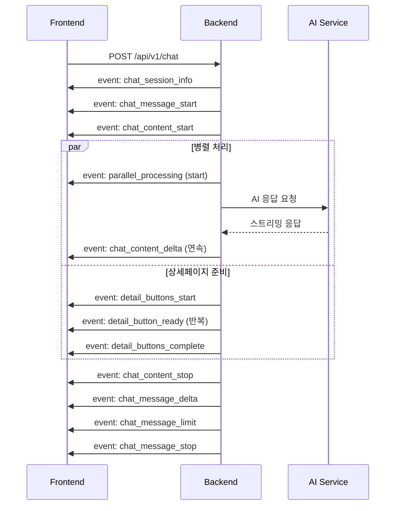
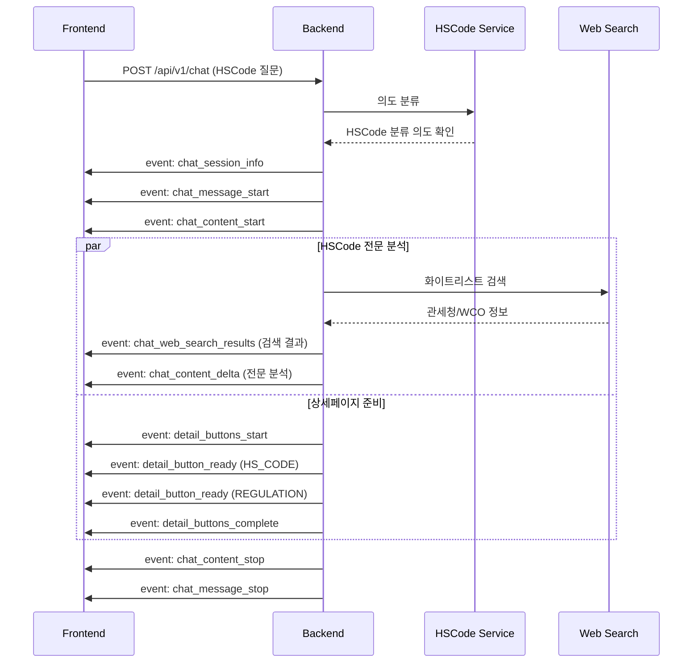

# SSE 이벤트 매핑 가이드 (v2.1)

## 📋 개요

무역 규제 레이더 플랫폼의 `/chat` 엔드포인트에서 발생하는 모든 SSE(Server-Sent Events) 이벤트의 표준화된 매핑 정보와 상세 데이터 구조를 제공합니다.

**개선 일자**: 2025-07-06  
**버전**: v2.1 (웹 검색 결과 분리 버전)

**주요 내용:**
- 📊 이벤트 매핑 테이블 (간략 구조)
- 🔍 상세 데이터 구조 (실제 JSON 예시)
- 📱 프론트엔드 구현 가이드
- 🛠️ 디버깅 및 체크리스트

## 🎯 개선 목표

- **파싱 단순화**: 이벤트 타입을 `data` 내부가 아닌 `event:` 필드로 직접 식별
- **일관된 네이밍**: 도메인별 일관된 접두사 사용 (`chat_*`, `parallel_*`, `detail_*`)
- **프론트엔드 친화적**: 명확한 이벤트 핸들러 구조 지원
- **SSE 표준 준수**: W3C SSE 표준에 맞는 이벤트 구조
- **데이터 분리**: 메인 텍스트와 웹 검색 결과를 별도 이벤트로 분리하여 파싱 최적화

## 📊 이벤트 매핑 테이블

### 1. 채팅 관련 이벤트

| **이벤트명**              | **설명**             | **발생 시점**         | **데이터 구조 (간략)**                                |
| ------------------------- | -------------------- | --------------------- | ----------------------------------------------------- |
| `chat_session_info`       | 세션 정보 전송       | 최초 연결 시          | `{session_uuid, timestamp}`                           |
| `chat_message_start`      | AI 메시지 시작       | 응답 생성 시작        | `{type: "message_start", message: {...}}`             |
| `chat_metadata_start`     | 메타데이터 블록 시작 | 새 세션인 경우        | `{type: "content_block_start", content_block: {...}}` |
| `chat_metadata_stop`      | 메타데이터 블록 종료 | 메타데이터 전송 완료  | `{type: "content_block_stop", ...}`                   |
| `chat_content_start`      | 텍스트 블록 시작     | 실제 텍스트 시작 전   | `{type: "content_block_start", content_block: {...}}` |
| `chat_content_delta`      | 텍스트 스트리밍      | 텍스트 생성 중 (연속) | `{type: "content_block_delta", delta: {text: "..."}}` |
| `chat_web_search_results` | 웹 검색 결과         | HSCode 분류 시        | `{type, results, timestamp, total_count}`             |
| `chat_content_stop`       | 텍스트 블록 종료     | 텍스트 생성 완료      | `{type: "content_block_stop", ...}`                   |
| `chat_message_delta`      | 메시지 메타데이터    | 메시지 종료 전        | `{type: "message_delta", delta: {stop_reason}}`       |
| `chat_message_limit`      | 메시지 제한 정보     | 메시지 완료 시        | `{type: "message_limit", message_limit: {...}}`       |
| `chat_message_stop`       | 메시지 종료          | 전체 응답 완료        | `{type: "message_stop"}`                              |

### 2. 병렬 처리 이벤트

| **이벤트명**          | **설명**       | **발생 시점** | **데이터 구조**                         |
| --------------------- | -------------- | ------------- | --------------------------------------- |
| `parallel_processing` | 병렬 작업 상태 | 병렬 처리 중  | `{stage, content, progress, timestamp}` |

**stage 값:**
- `parallel_processing_start`: 병렬 처리 시작
- `parallel_processing_progress`: 진행 상황 업데이트
- `parallel_processing_complete`: 병렬 처리 완료

### 3. 상세페이지 버튼 이벤트

| **이벤트명**              | **설명**            | **발생 시점**        | **데이터 구조**                                               |
| ------------------------- | ------------------- | -------------------- | ------------------------------------------------------------- |
| `detail_buttons_start`    | 버튼 준비 시작      | 상세페이지 분석 시작 | `{type: "start", buttonsCount, estimatedPreparationTime}`     |
| `detail_button_ready`     | 개별 버튼 준비 완료 | 각 버튼 준비 완료 시 | `{type: "button", buttonType, url, title, metadata}`          |
| `detail_buttons_complete` | 모든 버튼 준비 완료 | 버튼 생성 완료       | `{type: "complete", totalPreparationTime, buttonsGenerated}`  |
| `detail_buttons_error`    | 버튼 준비 오류      | 에러 발생 시         | `{type: "error", errorCode, errorMessage, fallbackActivated}` |

### 4. 연결 유지 이벤트

| **이벤트명** | **설명**       | **발생 시점**     | **데이터 구조**             |
| ------------ | -------------- | ----------------- | --------------------------- |
| `heartbeat`  | 연결 상태 확인 | 주기적 (30초마다) | `{session_uuid, timestamp}` |

---

## 🔍 상세 데이터 구조

### 1. 핵심 채팅 이벤트

#### `chat_session_info`
```json
{
  "session_uuid": "db9b08dc-a8aa-46e1-ba19-2b452a1851fb",
  "timestamp": 42720.5639276
}
```

#### `chat_message_start`
```json
{
  "type": "message_start",
  "message": {
    "id": "chatcompl_f204546a724945368021fe51",
    "type": "message",
    "role": "assistant",
    "model": "claude-sonnet-4-20250514",
    "parent_uuid": "9b516d69-2343-4c74-a219-f6f6e8eb3409",
    "uuid": "fd156e81-6301-4d0c-905f-45ec961f1c35",
    "content": [],
    "stop_reason": null,
    "stop_sequence": null
  }
}
```

#### `chat_content_start`
```json
{
  "type": "content_block_start",
  "index": 0,
  "content_block": {
    "start_timestamp": "2025-07-06T15:54:46.511229Z",
    "stop_timestamp": null,
    "type": "text",
    "text": "",
    "citations": []
  }
}
```

#### `chat_content_delta`
```json
{
  "type": "content_block_delta",
  "index": 0,
  "delta": {
    "type": "text_delta",
    "text": "안녕하세요! HS코드 분류를 도와드리겠습니다."
  }
}
```

#### `chat_web_search_results`
```json
{
  "type": "web_search_results",
  "timestamp": "2025-07-06T15:54:46.634438Z",
  "total_count": 3,
  "results": [
    {
      "type": "web_search_result",
      "title": "관세법령정보포털 CLIP",
      "url": "https://unipass.customs.go.kr/clip/index.do?opnurl=/hsinfosrch/openULS0201001Q.do",
      "content": "ErsBCioIBRgCIiQ5MTg3YmI5My0xYzM2LTQ1NjQtOWY0Zi04MzI3MjJjMjZkYzI...",
      "page_age": null,
      "metadata": {
        "source": "anthropic_web_search",
        "confidence": 0.8
      }
    },
    {
      "type": "web_search_result", 
      "title": "관세율표-부류목록 | HS정보 | 세계HS | 관세법령정보포털",
      "url": "https://unipass.customs.go.kr/clip/index.do?opnurl=/hsinfosrch/openULS0201002Q.do",
      "content": "ErsBCioIBRgCIiQ5MTg3YmI5My0xYzM2LTQ1NjQtOWY0Zi04MzI3MjJjMjZkYzI...",
      "page_age": null,
      "metadata": {
        "source": "anthropic_web_search",
        "confidence": 0.8
      }
    }
  ]
}
```

#### `chat_content_stop`
```json
{
  "type": "content_block_stop",
  "index": 0,
  "content_block": {
    "start_timestamp": "2025-07-06T15:54:46.511229Z",
    "stop_timestamp": "2025-07-06T15:54:47.123456Z",
    "type": "text",
    "text": "완성된 전체 텍스트 내용",
    "citations": []
  }
}
```

#### `chat_message_delta`
```json
{
  "type": "message_delta",
  "delta": {
    "stop_reason": "end_turn",
    "stop_sequence": null
  }
}
```

#### `chat_message_limit`
```json
{
  "type": "message_limit",
  "message_limit": {
    "type": "within_limit",
    "remaining": 45,
    "total": 50
  }
}
```

#### `chat_message_stop`
```json
{
  "type": "message_stop"
}
```

#### `chat_metadata_start` (새 세션만)
```json
{
  "type": "content_block_start",
  "index": 0,
  "content_block": {
    "start_timestamp": "2025-07-06T15:54:46.511229Z",
    "stop_timestamp": null,
    "type": "text",
    "text": "",
    "citations": []
  }
}
```

#### `chat_metadata_stop` (새 세션만)
```json
{
  "type": "content_block_stop",
  "index": 0,
  "content_block": {
    "start_timestamp": "2025-07-06T15:54:46.511229Z",
    "stop_timestamp": "2025-07-06T15:54:46.612345Z",
    "type": "text",
    "text": "새 세션이 시작되었습니다.",
    "citations": []
  }
}
```

### 2. 병렬 처리 이벤트

#### `parallel_processing`

**시작 단계:**
```json
{
  "stage": "parallel_processing_start",
  "content": "3단계 병렬 처리를 시작합니다: 자연어 응답, 상세페이지 준비, 회원 기록 저장",
  "progress": 15,
  "timestamp": "2025-07-06T15:54:46.634438Z"
}
```

**진행 단계:**
```json
{
  "stage": "parallel_processing_progress",
  "content": "HSCode 분류 및 상세정보 조회 중...",
  "progress": 65,
  "timestamp": "2025-07-06T15:54:47.123456Z"
}
```

**완료 단계:**
```json
{
  "stage": "parallel_processing_complete",
  "content": "모든 병렬 처리가 완료되었습니다.",
  "progress": 100,
  "timestamp": "2025-07-06T15:54:47.789012Z"
}
```

### 3. 상세페이지 관련 이벤트

#### `detail_buttons_start`
```json
{
  "type": "detail_buttons_start",
  "timestamp": "2025-07-06T15:54:47.123456Z",
  "estimated_count": 2
}
```

#### `detail_button_ready`
```json
{
  "type": "detail_button_ready",
  "button": {
    "id": "hs_code_detail_123",
    "text": "HS코드 8471.30.1000 상세정보",
    "category": "HS_CODE",
    "url": "/detail/hscode/8471.30.1000",
    "metadata": {
      "hscode": "8471.30.1000",
      "description": "휴대용 자동자료처리기계"
    }
  },
  "button_index": 0,
  "timestamp": "2025-07-06T15:54:47.234567Z"
}
```

#### `detail_buttons_complete`
```json
{
  "type": "detail_buttons_complete",
  "total_buttons": 2,
  "timestamp": "2025-07-06T15:54:47.345678Z"
}
```

#### `detail_buttons_error`
```json
{
  "type": "detail_buttons_error",
  "error": {
    "code": "EXTERNAL_API_TIMEOUT",
    "message": "상세페이지 정보 조회 시간이 초과되었습니다.",
    "details": "관세청 API 응답 시간 초과"
  },
  "fallback_activated": true,
  "timestamp": "2025-07-06T15:54:47.456789Z"
}
```

### 4. 연결 유지 이벤트

#### `heartbeat`
```json
{
  "session_uuid": "db9b08dc-a8aa-46e1-ba19-2b452a1851fb",
  "timestamp": 42720.5639276
}
```

**설명:** 클라이언트와의 연결 상태를 주기적으로 확인하기 위해 전송되는 이벤트입니다. 일반적으로 30초마다 전송되며, 네트워크 지연이나 프록시 타임아웃을 방지합니다.

## 🔄 개선 전후 비교

### Before (v1.0 - 문제점)

```javascript
// 모든 이벤트가 기본 'message' 타입으로 전송
eventSource.addEventListener('message', (event) => {
  const data = JSON.parse(event.data);
  
  // data 내부 type 필드로 구분해야 함
  if (data.type === 'content_block_delta') {
    appendText(data.delta.text);
  } else if (data.stage === 'parallel_processing_start') {
    updateProgress(data.progress);
  } else if (data.type === 'button') {
    addButton(data);
  }
  // 복잡한 분기 처리 필요
});
```

**문제점:**
- 모든 이벤트를 `message` 타입으로 받아야 함
- `data` 내부 필드로 이벤트 타입 구분
- 복잡한 조건문 필요
- 이벤트 타입 오타 발생 가능성
- 브라우저 개발자 도구에서 디버깅 어려움

### After (v2.0 - 해결됨)

```javascript
// 명확한 이벤트 타입별 핸들러
eventSource.addEventListener('chat_content_delta', (event) => {
  const data = JSON.parse(event.data);
  appendText(data.delta.text);
});

eventSource.addEventListener('parallel_processing', (event) => {
  const data = JSON.parse(event.data);
  updateProgress(data.progress, data.content);
});

eventSource.addEventListener('detail_button_ready', (event) => {
  const button = JSON.parse(event.data);
  addButton(button);
});
```

### After (v2.1 - 웹 검색 결과 분리)

```javascript
// 메인 텍스트 (순수 AI 응답만)
eventSource.addEventListener('chat_content_delta', (event) => {
  const data = JSON.parse(event.data);
  appendText(data.delta.text); // JSON 없는 순수 텍스트
});

// 웹 검색 결과 (구조화된 데이터)
eventSource.addEventListener('chat_web_search_results', (event) => {
  const data = JSON.parse(event.data);
  displaySearchResults(data.results); // 별도 UI 컴포넌트로 표시
});

eventSource.addEventListener('parallel_processing', (event) => {
  const data = JSON.parse(event.data);
  updateProgress(data.progress, data.content);
});

eventSource.addEventListener('detail_button_ready', (event) => {
  const button = JSON.parse(event.data);
  addButton(button);
});
```

**v2.1 추가 장점:**
- 메인 텍스트와 웹 검색 결과 완전 분리
- JSON 파싱 오류 없는 안정적인 텍스트 스트리밍
- 웹 검색 결과의 구조화된 메타데이터 활용 가능
- 프론트엔드에서 개별 UI 컴포넌트로 최적화된 표시

## 📱 프론트엔드 구현 가이드

### 1. 기본 EventSource 설정

```javascript
const eventSource = new EventSource('/api/v1/chat', {
  withCredentials: true
});

// 연결 상태 관리
eventSource.onopen = () => {
  console.log('SSE 연결 성공');
};

eventSource.onerror = (error) => {
  console.error('SSE 연결 오류:', error);
};
```

### 2. 이벤트 핸들러 등록

```javascript
// 연결 상태 확인
eventSource.addEventListener('heartbeat', (event) => {
  const heartbeatData = JSON.parse(event.data);
  console.log('연결 유지:', heartbeatData.timestamp);
  
  // 연결 상태 UI 업데이트 (선택사항)
  updateConnectionStatus('connected');
});

// 세션 정보 처리
eventSource.addEventListener('chat_session_info', (event) => {
  const sessionInfo = JSON.parse(event.data);
  console.log('세션 UUID:', sessionInfo.session_uuid);
  
  // 세션 정보 저장
  localStorage.setItem('session_uuid', sessionInfo.session_uuid);
});

// 메시지 시작
eventSource.addEventListener('chat_message_start', (event) => {
  const messageData = JSON.parse(event.data);
  console.log('메시지 시작:', messageData.message.id);
  
  // UI 초기화
  clearCurrentMessage();
  showTypingIndicator();
});

// 텍스트 스트리밍
eventSource.addEventListener('chat_content_delta', (event) => {
  const deltaData = JSON.parse(event.data);
  const text = deltaData.delta.text;
  
  // 실시간 텍스트 추가 (순수 텍스트만, JSON 없음)
  appendTextToCurrentMessage(text);
});

// 웹 검색 결과 처리 (HSCode 분류 시)
eventSource.addEventListener('chat_web_search_results', (event) => {
  const searchData = JSON.parse(event.data);
  
  // 웹 검색 결과를 별도 UI 영역에 표시
  displayWebSearchResults({
    results: searchData.results,
    totalCount: searchData.total_count,
    timestamp: searchData.timestamp
  });
});

// 병렬 처리 상태
eventSource.addEventListener('parallel_processing', (event) => {
  const processData = JSON.parse(event.data);
  
  // 진행률 업데이트
  updateProgressBar(processData.progress);
  showProcessMessage(processData.content);
});

// 상세 버튼 준비
eventSource.addEventListener('detail_button_ready', (event) => {
  const buttonData = JSON.parse(event.data);
  
  // 버튼 UI 생성
  createDetailButton({
    type: buttonData.buttonType,
    title: buttonData.title,
    url: buttonData.url,
    description: buttonData.description
  });
});

// 메시지 완료
eventSource.addEventListener('chat_message_stop', (event) => {
  console.log('메시지 완료');
  
  // UI 정리
  hideTypingIndicator();
  enableInputField();
});
```

### 3. React/Vue.js 컴포넌트 예시

#### React 훅 예시

```javascript
import { useEffect, useState } from 'react';

export function useChatSSE(chatEndpoint) {
  const [messages, setMessages] = useState([]);
  const [isStreaming, setIsStreaming] = useState(false);
  const [currentMessage, setCurrentMessage] = useState('');
  const [sessionUuid, setSessionUuid] = useState(null);
  const [webSearchResults, setWebSearchResults] = useState([]);

  useEffect(() => {
    const eventSource = new EventSource(chatEndpoint);

    // 연결 상태 확인
    eventSource.addEventListener('heartbeat', (event) => {
      const data = JSON.parse(event.data);
      console.log('연결 유지:', data.timestamp);
    });

    // 세션 정보
    eventSource.addEventListener('chat_session_info', (event) => {
      const data = JSON.parse(event.data);
      setSessionUuid(data.session_uuid);
    });

    // 메시지 시작
    eventSource.addEventListener('chat_message_start', (event) => {
      setIsStreaming(true);
      setCurrentMessage('');
    });

    // 텍스트 스트리밍
    eventSource.addEventListener('chat_content_delta', (event) => {
      const data = JSON.parse(event.data);
      setCurrentMessage(prev => prev + data.delta.text);
    });

    // 웹 검색 결과
    eventSource.addEventListener('chat_web_search_results', (event) => {
      const data = JSON.parse(event.data);
      setWebSearchResults(data.results);
    });

    // 메시지 완료
    eventSource.addEventListener('chat_message_stop', (event) => {
      setIsStreaming(false);
      setMessages(prev => [...prev, { 
        text: currentMessage, 
        timestamp: new Date(),
        searchResults: webSearchResults
      }]);
      setCurrentMessage('');
      setWebSearchResults([]);
    });

    return () => {
      eventSource.close();
    };
  }, [chatEndpoint]);

  return { messages, currentMessage, isStreaming, sessionUuid, webSearchResults };
}
```

#### Vue.js 컴포저블 예시

```javascript
import { ref, onMounted, onUnmounted } from 'vue';

export function useChatSSE(chatEndpoint) {
  const messages = ref([]);
  const isStreaming = ref(false);
  const currentMessage = ref('');
  const sessionUuid = ref(null);
  const webSearchResults = ref([]);
  let eventSource = null;

  onMounted(() => {
    eventSource = new EventSource(chatEndpoint);

    eventSource.addEventListener('heartbeat', (event) => {
      const data = JSON.parse(event.data);
      console.log('연결 유지:', data.timestamp);
    });

    eventSource.addEventListener('chat_session_info', (event) => {
      const data = JSON.parse(event.data);
      sessionUuid.value = data.session_uuid;
    });

    eventSource.addEventListener('chat_message_start', (event) => {
      isStreaming.value = true;
      currentMessage.value = '';
    });

    eventSource.addEventListener('chat_content_delta', (event) => {
      const data = JSON.parse(event.data);
      currentMessage.value += data.delta.text;
    });

    eventSource.addEventListener('chat_web_search_results', (event) => {
      const data = JSON.parse(event.data);
      webSearchResults.value = data.results;
    });

    eventSource.addEventListener('chat_message_stop', (event) => {
      isStreaming.value = false;
      messages.value.push({ 
        text: currentMessage.value, 
        timestamp: new Date(),
        searchResults: webSearchResults.value
      });
      currentMessage.value = '';
      webSearchResults.value = [];
    });
  });

  onUnmounted(() => {
    if (eventSource) {
      eventSource.close();
    }
  });

  return { messages, currentMessage, isStreaming, sessionUuid, webSearchResults };
}
```

## 🌊 이벤트 플로우

### 일반 채팅 플로우



### HSCode 분류 플로우



## 🛠️ 디버깅 가이드

### 1. 브라우저 개발자 도구

**Network 탭에서 SSE 모니터링:**
```
1. F12 개발자 도구 열기
2. Network 탭 선택
3. EventStream 필터 적용
4. 각 이벤트의 타입과 데이터 확인 가능
```

### 2. 콘솔 로그 예시

```javascript
// 모든 SSE 이벤트 로깅
const eventTypes = [
  'heartbeat', 'chat_session_info', 'chat_message_start', 'chat_metadata_start',
  'chat_metadata_stop', 'chat_content_start', 'chat_content_delta', 
  'chat_web_search_results', 'chat_content_stop', 'parallel_processing',
  'detail_buttons_start', 'detail_button_ready', 'detail_buttons_complete',
  'detail_buttons_error', 'chat_message_delta', 'chat_message_limit', 
  'chat_message_stop'
];

eventTypes.forEach(eventType => {
  eventSource.addEventListener(eventType, (event) => {
    console.group(`🔔 SSE Event: ${eventType}`);
    console.log('Raw Data:', event.data);
    console.log('Parsed Data:', JSON.parse(event.data));
    console.log('Timestamp:', new Date().toISOString());
    console.groupEnd();
  });
});
```

### 3. 일반적인 문제와 해결책

| **문제**           | **원인**           | **해결책**                   |
| ------------------ | ------------------ | ---------------------------- |
| 이벤트를 받지 못함 | 잘못된 이벤트명    | 이벤트명 확인 (오타 체크)    |
| JSON 파싱 오류     | 잘못된 데이터 형식 | `try-catch`로 파싱 오류 처리 |
| 연결 끊김          | 네트워크 문제      | 재연결 로직 구현             |
| 중복 이벤트 핸들러 | 컴포넌트 재마운트  | 이벤트 리스너 정리           |

## 📋 체크리스트

### 프론트엔드 구현 체크리스트

- [ ] EventSource 연결 설정 완료
- [ ] 필수 이벤트 핸들러 등록 (`chat_content_delta`, `chat_message_stop`)
- [ ] 연결 유지 이벤트 핸들러 등록 (`heartbeat`)
- [ ] 웹 검색 결과 이벤트 핸들러 등록 (`chat_web_search_results`)
- [ ] 에러 처리 로직 구현
- [ ] 연결 상태 UI 표시
- [ ] 컴포넌트 언마운트 시 EventSource 정리
- [ ] 세션 정보 저장 및 관리
- [ ] 진행률 및 상태 표시 UI
- [ ] 상세 버튼 동적 생성
- [ ] 웹 검색 결과 별도 UI 컴포넌트 구현
- [ ] 메타데이터 이벤트 처리 (새 세션 시)
- [ ] 디버깅 로그 구현

### 백엔드 구현 체크리스트

- [ ] 모든 이벤트에 명확한 `event:` 이름 부여
- [ ] 일관된 네이밍 컨벤션 적용
- [ ] 웹 검색 결과 감지 및 분리 로직 구현
- [ ] 메인 텍스트와 구조화된 데이터 분리 전송
- [ ] Heartbeat 이벤트 주기적 전송 (30초 간격)
- [ ] 세션 UUID 일관된 전송
- [ ] JSON 직렬화 오류 방지
- [ ] 에러 상황에서의 적절한 이벤트 전송
- [ ] CORS 헤더 설정
- [ ] 연결 해제 감지 및 정리

## 📚 참고 자료

- [W3C Server-Sent Events 명세](https://html.spec.whatwg.org/multipage/server-sent-events.html)
- [MDN EventSource API](https://developer.mozilla.org/en-US/docs/Web/API/EventSource)
- [FastAPI SSE 가이드](https://fastapi.tiangolo.com/advanced/server-sent-events/)

---

**문서 버전**: v2.1  
**최종 수정**: 2025-07-06  
**작성자**: AI 개발팀 