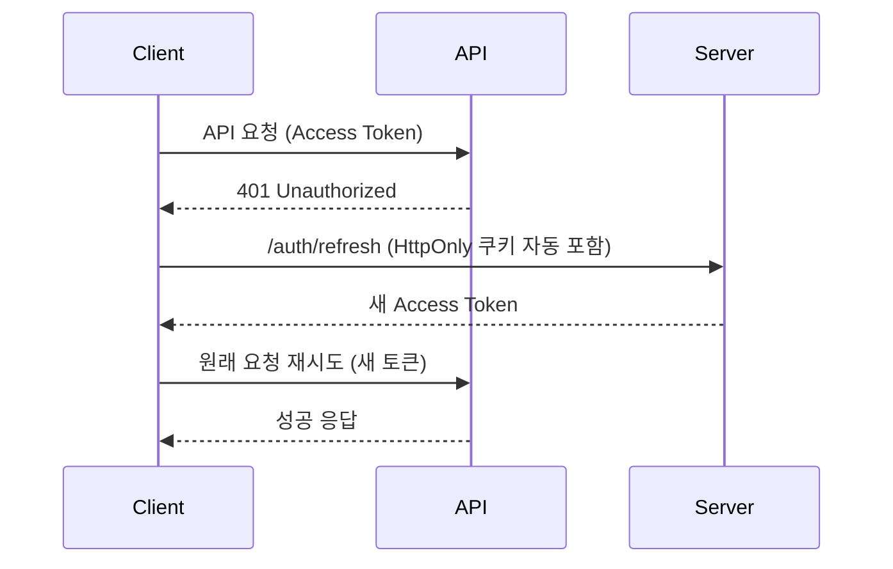

# 🔐 v6.1 인증 시스템 아키텍처

## 📋 개요

v6.1의 JWT 세부화 정책을 준수하는 **HttpOnly 쿠키 기반 인증 시스템**입니다.

### 🏗️ 핵심 아키텍처

- **Access Token**: 30분 만료, 메모리 저장 (tokenStore)
- **Refresh Token**: HttpOnly 쿠키, 서버에서만 관리
- **자동 토큰 갱신**: 401 응답 시 자동 갱신 및 재시도

## 🔧 주요 컴포넌트

### 1. TokenStore (`tokenStore.ts`)
```typescript
// Access Token 메모리 관리
const token = tokenStore.getToken();
const isAuth = tokenStore.isAuthenticated();
const expiry = tokenStore.getTokenExpiryDate();
```

**기능:**
- JWT 페이로드에서 만료 시간 자동 추출
- 만료 1분 전 조기 갱신 준비
- 토큰 변경 이벤트 리스너 지원

### 2. AuthService (`authService.ts`)
```typescript
// 인증 API 호출
await authService.login({ email, password, rememberMe });
await authService.logout(); // HttpOnly 쿠키 삭제
await authService.refreshToken(); // 수동 토큰 갱신
```

**특징:**
- HttpOnly 쿠키는 서버에서만 삭제 가능
- 클라이언트 데이터 정리 (`clearClientAuthData`)
- OAuth 콜백 처리 지원

### 3. AuthStore (`authStore.ts`)
```typescript
// Zustand 기반 상태 관리
const { user, isAuthenticated, login, logout } = useAuth();
```

**초기화 플로우:**
1. 기존 Access Token 유효성 확인
2. HttpOnly 쿠키로 토큰 갱신 시도 (API 호출)
3. 실패 시 로그아웃 상태로 설정

### 4. HttpClient (`httpClient.ts`)
```typescript
// 자동 토큰 갱신 및 재시도
const data = await httpClient.get<UserType>('/user/profile');
```

**자동 처리:**
- 요청 시 Access Token 자동 첨부
- 401 응답 시 자동 토큰 갱신
- 갱신 성공 시 원래 요청 재시도
- 동시 갱신 요청 방지 (Promise 캐싱)

## 🚨 중요한 설계 원칙

### ❌ HttpOnly 쿠키 제약사항

```typescript
// 🚫 불가능: JavaScript로 HttpOnly 쿠키 접근
document.cookie; // 리프레시 토큰 읽을 수 없음

// ✅ 올바른 방법: API 호출로 간접 확인
try {
  await authService.refreshToken(); // 쿠키 유효성 간접 확인
} catch (error) {
  // 쿠키 없거나 만료됨
}
```

### ✅ 올바른 사용 패턴

```typescript
// 초기화 (앱 시작 시)
await authStore.initialize();

// 로그인
await authStore.login(email, password, rememberMe);

// 로그아웃 (서버에서 HttpOnly 쿠키 삭제)
await authStore.logout();

// 수동 토큰 갱신
await authStore.refreshToken();
```

## 🛠️ 클라이언트 데이터 정리

HttpOnly 쿠키 방식을 사용하므로 클라이언트에서 쿠키를 직접 조작하지 않습니다.

```typescript
// 로그아웃 시 자동으로 호출됨
authService.clearClientAuthData(); // 로컬/세션 스토리지만 정리
```

**정리 대상:**
- 로컬 스토리지의 인증 관련 데이터
- 세션 스토리지의 인증 관련 데이터
- HttpOnly 쿠키는 서버에서만 삭제 가능

## 🔄 토큰 갱신 플로우



## 🎯 베스트 프랙티스

### 1. 초기화
```typescript
// App.tsx 또는 main.tsx
useEffect(() => {
  authStore.initialize();
}, []);
```

### 2. 인증 상태 확인
```typescript
const { isAuthenticated, isLoading } = useAuth();

if (isLoading) return <LoadingSpinner />;
if (!isAuthenticated) return <LoginPage />;
```

### 3. API 호출
```typescript
// httpClient가 자동으로 토큰 관리
const userData = await httpClient.get<User>('/user/profile');
```

### 4. 로그아웃
```typescript
// 서버 로그아웃 + 클라이언트 정리
await authStore.logout();
```

## 🐛 트러블슈팅

### 문제: 토큰이 계속 갱신되지 않음
```typescript
// 확인사항:
// 1. 서버에서 HttpOnly 쿠키 설정 확인
// 2. withCredentials: true 설정 확인
// 3. 브라우저 개발자 도구에서 쿠키 확인
```

### 문제: 무한 리디렉션
```typescript
// 해결책: 로그인 페이지에서 initialize 호출 방지
if (pathname !== '/auth/login') {
  await authStore.initialize();
}
```

### 문제: CORS 에러
```typescript
// 서버 설정 필요:
// - credentials: true
// - 정확한 origin 설정
// - 쿠키 도메인 설정
```

## 📈 성능 최적화

1. **토큰 갱신 캐싱**: 동시 요청 시 하나의 갱신만 수행
2. **조기 갱신**: 만료 1분 전 미리 갱신 준비
3. **메모리 저장**: Access Token은 메모리에만 저장 (XSS 방어)
4. **자동 재시도**: 401 시 자동 갱신 후 재시도

## 🔒 보안 고려사항

- ✅ **XSS 방어**: Access Token은 메모리 저장
- ✅ **CSRF 방어**: HttpOnly 쿠키 + SameSite 설정  
- ✅ **자동 만료**: 토큰 만료 시간 추적
- ✅ **안전한 정리**: 로그아웃 시 모든 인증 데이터 삭제 